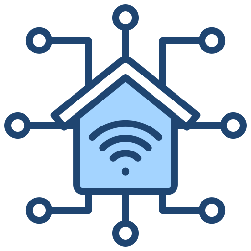

# Home Assistant IHC RS232 Add-on

Connects LK/Gardy IHC Controllers to Home Assistant via RS232 and MQTT.

## Installation

1. Add this repository to Home Assistant:
   - Go to **Supervisor** → **Add-on Store** → **⋮** (top right) → **Repositories**
   - Add: `https://github.com/JOUW_USERNAME/homeassistant-ihcRS232-addon`

2. Install the "IHC RS232 MQTT Bridge" add-on

3. Configure the add-on (see Configuration tab)

4. Start the add-on

5. Check the logs to verify connection

6. Go to **Settings → Devices & Services → MQTT** to see all entities

## Hardware Requirements

- USB to RS232 adapter (DB9 connector)
- IHC Controller with RS232 port
- MQTT broker (Mosquitto add-on recommended)

## Configuration

See the add-on's Documentation tab for detailed configuration options.

## Features

- ✅ RS232 communication with IHC controller
- ✅ MQTT integration with Home Assistant
- ✅ Auto-discovery of all entities
- ✅ Support for up to 16 output modules (128 outputs)
- ✅ Support for up to 16 input modules (256 inputs)
- ✅ Configurable polling interval
- ✅ Full logging support

## Support

For issues and questions:
https://github.com/JOUW_USERNAME/homeassistant-ihcRS232-addon/issues

## License

MIT License